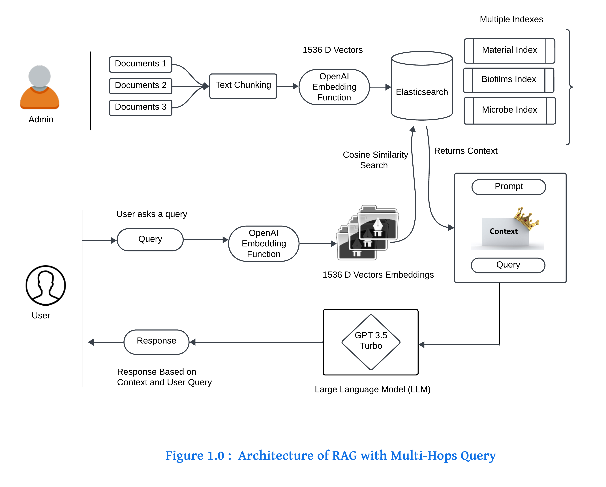
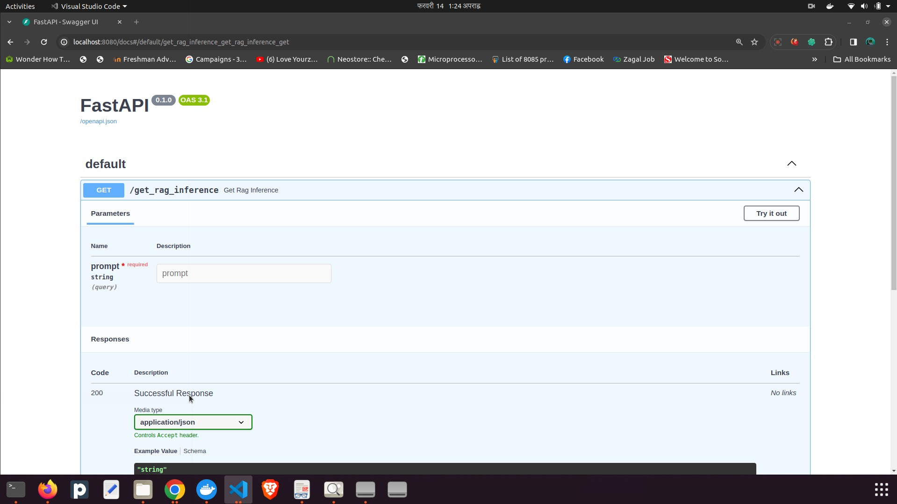

# Multi Hops RAG System 
Multi-hops Retrieval-augmented generation (MRAG) is a system that enhances large language models (LLMs) by retrieving relevant contextual knowledge. Thus addressing LLM hallucinations, and improving response quality by leveraging in-context learning.

#### System Architecutre

That is a system architecture followed by above multi hops RAG System.
You can find the detail explanation of architecture [here.](./assets/architecture_explanation.pdf).

You can also refer to the lucid chart diagram given below and you can make some comments regarding the improvement of a system.
[Go to Lucid Chart Diagram.](https://lucid.app/lucidspark/dc2502f8-c0da-431f-a7fb-613d32f5bdae/edit?viewport_loc=-812%2C-118%2C3840%2C1862%2C0_0&invitationId=inv_55a3e945-f28f-4432-b264-70a9a6594a53)


### Requirements

```sh
Python v3.8
Elasticsearch @latest 
```

### Installation Guide

- Copy `.env-SAMPLE` to `.env` and configure the environment variables

To run the fast api server,
```sh
    pip install -r requirements.txt
    pipenv run start_api
```


### Guideline for Indexing Documents
prerequisites: Before running the script, create folders inside `./documents` and add pdf files that you want to index inside each folder.

Note: Every folders inside the `./documents` creates index in Elasticsearch and every documents inside the corresponding folder are indexed.

To run the indexing script,
```sh
pipenv run index_documents
```

### Create Docker Image and Run the Container
```sh
 docker build -t multi_hop_rag .
 docker run -d --name multi_hop_rag -p 8080:8080
```
Note: At default application runs at port 8080

### API Documentation
You can refer to the fast api documentation that uses openapi 3.0 at the following link
[Swagger Documentation for Fast API.](http://localhost:8080/docs).
i.e. http://thisapphost.com/docs


You will get above swagger docs for your reference after visiting the documentation url.


### Contributing

Contributions are always welcome!

See `contributing.md` for ways to get started.

Please adhere to this project's `code of conduct`.
